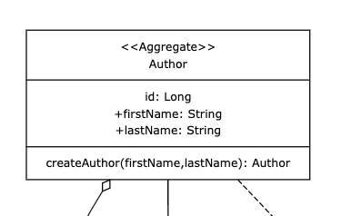
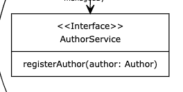

# 4: Create the register Author command
For this step you will need to create classes and an interface in two different packages in our project.

### Command
We need to create a REST endpoint that allows us to register Authors.

```http request
### Register an author
POST /authors/commands/register HTTP/1.1
Host: localhost:8080
Content-Type: application/json

{
  "firstName": "PLACE_YOUR_FIRST_NAME",
  "lastName": "PLACE_YOUR_LAST_NAME"
}
```
This endpoint should create an Author from the given Data Transfer Object (DTO) (or payload) and call the register
function of an author on the domain layer service (a port / interface). The standard response should be empty with 
status 
code 202.

> **Tip:** You can add the above snippet in a file ``./http/AuthorCommands.http`` which allows you to execute the 
> request from inside your IDE (if supported, IntelliJ does).

### Domain Core
According to the domain model we need to create the class ```/domain/author/Author.java``` in our domain package. To 
keep control of the creation of our aggregates we make the all args constructor private and instead create a 
factory method ``public static Author createAuthor(String fristName, String lastName)``. Only our factory method will
access the private all args constructor. That way we can keep control of the creation of Authors at all times outside our domain package.
For now that is all we need. No getters, no setters or builders needed for now. In case you are asking yourself: 
_And what about the id?_ Rest assured! We will solve this one later. It remains _null_ for now.



### The data port
In order to be able to interact with our domain, we need to define a port (interface) called
```/domain/author/AuthorService.java``` in our domain package. The required members can be found in the 
domain model. Afterwards, we inject this into our ```AuthorCommands.java```class in the constructor 
(you could autowire it but let's stick to constructor injection).

> **Nice to know:** this complies with the SOLID principle of 'dependency inversion'. Good for us :)



### The Data Layer
No injection without at least one Spring Bean implementing the interface. After having injected the interace, at 
least INtelliJ will show a warning or error that it requires at least one implementation.In 
```/data/author/AuthorServiceImpl.java``` we implement ```/domain/author/AuthorService.java``` and annotate it with the ```@Service``` annotation from Spring. 
For now, simply add a log statement of your choice to the implementation of the method ``void registerAuthor(Author author)``.

### Validation
Let's test our code. Feel free to write your own test. Alternatively, copy and paste this test class into your project 
and run it. All should be green :-).

```java
@SpringBootTest
@AutoConfigureMockMvc
class AuthorCommandsTest {

    @Autowired
    private MockMvc mockMvc;

    @Autowired
    private ObjectMapper objectMapper;

    @Test
    void register() throws Exception {
        //given
        var registerAuthorPayloadJson = objectMapper.writeValueAsString(new RegisterAuthorPayload("firstName", "lastName"));

        //when //then
        mockMvc.perform(post("/authors/commands/register")
                        .contentType(MediaType.APPLICATION_JSON)
                        .content(registerAuthorPayloadJson))
                .andExpect(status().isAccepted());
    }
}
```

### OPTIONAL: Run the app on localhost
By the way, if you run the docker compose file ``./docker-compose.yml`` and start the Spring app you can also test your 
API at runtime manually.
Got to ``http/AuthorCommands.http`` and run the request against your localhost:8080.


```javascript
if (allTestsGreen == true) {
    log.info("DONE! Let's move on to the next topic: **Persisting Data**.")}
else{
    log.error("Shout for help!") || (git stash && git checkout 4-create-author-command-done)
}
```


