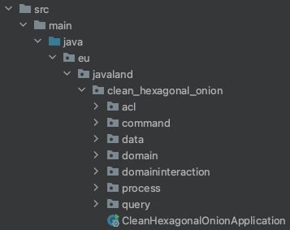
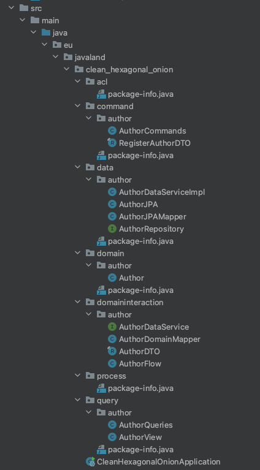

# Separate the Domain Interaction Layer

The keen observer might have realised already, we are missing one layer in our package structure.
For simplicity in the beginning, we skipped that extra layer of segregation between our Domain Code Layer
and the External Adapters Layer, consisting of Query, Command, Process, Data and ACL.

However, this is leaves us with some incorrect code, and essentially we violate the principles introduced
in the Clean Hexagonal Onion concept. Can you guess where that is?

Let us have a look at the classes ``eu/javaland/clean_hexagonal_onion/command/author/AuthorCommands.java`` and 
``eu/javaland/clean_hexagonal_onion/query/author/AuthorQueries.java``. Currently, they both  import the domain class 
``Auhtor.java``. And this is wrong, because we said that we want to protect our domain from the outside world and
have only our domain interaction layer interact with the domain core.

This chapter is aimed at fixing that mistake.

### Fixing the package structure
We start by adding the missing package ``domaininteraction`` to the package ``eu/javaland/clean_hexagonal_onion``


Also, create the package ``eu/javaland/clean_hexagonal_onion/domaininteraction/author`` inside there.

### Verifying what is wrong
TDD to the rescue! Here is a test that will show you what we did wrong so far. We will use
ArchUnit for this:

Add the dependency to the ./pom.xml file:

``` xml
<!-- Test Dependencies-->
<dependency>
    <groupId>com.tngtech.archunit</groupId>
    <artifactId>archunit-junit5</artifactId>
    <version>1.0.1</version>
    <scope>test</scope>
</dependency>
```
Here is the test we add to ``src/test/java/eu/javaland/clean_hexagonal_onion/CleanHexagonalOnionArchitectureTest.java``:
``` java
package eu.javaland.clean_hexagonal_onion;

import com.tngtech.archunit.core.importer.ImportOption;
import com.tngtech.archunit.junit.AnalyzeClasses;
import com.tngtech.archunit.junit.ArchTest;
import com.tngtech.archunit.lang.ArchRule;

import static com.tngtech.archunit.library.Architectures.layeredArchitecture;

@AnalyzeClasses(packages = "eu.javaland.clean_hexagonal_onion",
                importOptions = {ImportOption.DoNotIncludeTests.class})
public class CleanHexagonalOnionArchitectureTest {

    @ArchTest
    static final ArchRule layer_dependencies_are_respected =
            layeredArchitecture().consideringAllDependencies()

            .layer("command").definedBy("eu.javaland.clean_hexagonal_onion.command..")
            .layer("query").definedBy("eu.javaland.clean_hexagonal_onion.query..")
            .layer("data").definedBy("eu.javaland.clean_hexagonal_onion.data..")
            .layer("domain interaction").definedBy("eu.javaland.clean_hexagonal_onion.domaininteraction..")
            .layer("domain").definedBy("eu.javaland.clean_hexagonal_onion.domain..")

            .whereLayer("command").mayNotBeAccessedByAnyLayer()
            .whereLayer("query").mayNotBeAccessedByAnyLayer()
            .whereLayer("data").mayNotBeAccessedByAnyLayer()
            .whereLayer("domain interaction").mayOnlyBeAccessedByLayers("command", "query", "data")
            .whereLayer("domain").mayOnlyBeAccessedByLayers("domain interaction");
}
```
> Note that ACL and Process are still missing in there. Since they are still empty packages our test would fail.
> We will add them later on.

Run the test. It will throw quite a few errors, pointing out to us the classes where we violated those
dependency rules.

### Moving code around
Let's start fixing things. First we move the interface ``eu/javaland/clean_hexagonal_onion/domain/author/AuthorService.
java``
to ``eu/javaland/clean_hexagonal_onion/domaininteraction/author/AuthorService.java``. Since it is essentially a port
we defined to access our data source, it needs to reside in the domain interaction layer.

Looking at that interface, and considering the Single Responsibility Principle from SOLID, let us
rename the interface so that it clearly states its purpose: `AuthorService` becomes `AuthorDataService`

``` java
public interface AuthorDataService {
    void save(AuthorDTO author);
    List<AuthorDTO> findAll();
}
```

> **Notice** that we renamed the function registerAuthor to save here since it better describes what we are trying 
> to achieve here. We also removed any reference to the domain core in our port and instead introduced a AuthorDTO 
> (data transfer object) that will function as a mapping layer between the domain core and the external adapters.

### Removing domain core access in the External Adapter layer

We now need to update the classes ``eu/javaland/clean_hexagonal_onion/command/author/AuthorCommands.java`` and
``eu/javaland/clean_hexagonal_onion/query/author/AuthorQueries.java`` so that they do not have to import 
``eu/javaland/clean_hexagonal_onion/domain/author/Author.java`` any longer.

For that purpose we need add a Flow to the domain interaction layer that makes needed functionality available to the
external adapter layer. We create the ``eu/javaland/clean_hexagonal_onion/domaininteraction/author/AuthorFlow.java``,
which will be our port for exposing the Author registration logic (in case of the command) and the finding all Authors
logic (in case of query).

Let's do some TDD! Here is the test for the flow class:

``` java
package eu.javaland.clean_hexagonal_onion.domaininteraction.author;

import org.junit.jupiter.api.Test;
import org.junit.jupiter.api.extension.ExtendWith;
import org.mockito.ArgumentCaptor;
import org.mockito.InjectMocks;
import org.mockito.Mock;
import org.mockito.junit.jupiter.MockitoExtension;

import java.util.List;

import static org.assertj.core.api.Assertions.assertThat;
import static org.mockito.Mockito.times;
import static org.mockito.Mockito.verify;
import static org.mockito.Mockito.when;

@ExtendWith(MockitoExtension.class)
class AuthorFlowTest {

    @Mock
    private AuthorDataService authorDataService;

    @InjectMocks
    private AuthorFlow authorFlow;

    @Test
    void registerAuthorByName() {
        // given
        var expectedAuthor = new AuthorDTO(null, "firstName", "lastName");
        ArgumentCaptor<AuthorDTO> argumentCaptor = ArgumentCaptor.forClass(AuthorDTO.class);
        // when
        authorFlow.registerAuthorByName("firstName", "lastName");
        // then
        verify(authorDataService, times(1)).save(argumentCaptor.capture());
        AuthorDTO actualAuthor = argumentCaptor.getValue();
        assertThat(actualAuthor).usingRecursiveComparison().isEqualTo(expectedAuthor);
    }

    @Test
    void getListOfAllAuthors() {
        // given
        var authorsData = List.of(
                new AuthorDTO(1L, "firstName1", "lastName1"),
                new AuthorDTO(2L, "firstName2", "lastName2"));
        when(authorDataService.findAll()).thenReturn(authorsData);
        // when
        List<AuthorDTO> actualResult = authorFlow.getListOfAllAuthors();
        // then
        assertThat(actualResult).containsExactlyInAnyOrder(new AuthorDTO(1L, "firstName1", "lastName1"),
                new AuthorDTO(2L, "firstName2", "lastName2"));
    }
}
```
> **Notice** that we introduced an AuthorDTO object. This is the pattern we use for isolating our domain core from the
> outside world. 

Once you are done implementing, we will need to update the command and query controllers. They should not directly access
the `AuthorDataService` but instead make use of the `AuthorFlow` class in the domain interaction layer.

### Splitting up the AuthorMapper

You might have realised already, our AuthorMapper does not comply either. He is located in the external
adapter layer (data) but has knowledge of our domain core, namely `Author.java`.

Here are some tests you can add to your code in order to TDD our way out of this dilemma:

``` java
package eu.javaland.clean_hexagonal_onion.data.author;

import eu.javaland.clean_hexagonal_onion.domaininteraction.author.AuthorDTO;
import org.junit.jupiter.api.Test;

import static org.assertj.core.api.Assertions.assertThat;

class AuthorJPAMapperTest {

    @Test
    void mapToJPA() {
        // given
        AuthorDTO input = new AuthorDTO(1L, "first", "last");
        AuthorJPA expectedOutput = AuthorJPA.builder()
                .id(1L)
                .firstName("first")
                .lastName("last")
                .build();
        // when
        AuthorJPA result = AuthorJPAMapper.mapToJPA(input);
        // then
        assertThat(result).usingRecursiveComparison().isEqualTo(expectedOutput);
    }
}
```
and
``` java
package eu.javaland.clean_hexagonal_onion.domaininteraction.author;

import eu.javaland.clean_hexagonal_onion.domain.author.Author;
import org.junit.jupiter.api.Test;

import static org.assertj.core.api.Assertions.assertThat;

class AuthorDomainMapperTest {

    @Test
    void mapToDomain() {
        // given
        var input = new AuthorDTO(1L, "first", "last");
        var expectedOutput = Author.restore()
                .id(1L)
                .firstName("first")
                .lastName("last")
                .build();
        // when
        var result = AuthorDomainMapper.mapToDomain(input);
        // then
        assertThat(result).usingRecursiveComparison().isEqualTo(expectedOutput);
    }
}
```
After updating the mapper structure, make sure you update the rest of the classes where necessary.
Pay special attention to the classes that interact with each other across the layers.
There should not be any outward facing dependencies left after completing this chapter.

Eventually, you should end up with a file tree similar to this one:



This was a bit of a hassle, but we are now all lined up for an even deeper dive into
the clean hexagonal onion and its perks.

**Well done so far!**

```javascript
if (allTestsGreen == true) {
    log.info("DONE! Let's move on to the next topic: n+1 - Do it yourself")}
else{
    log.error("Shout for help!") || (git stash && git checkout 7-separate-domain-interaction-done)
}
```
